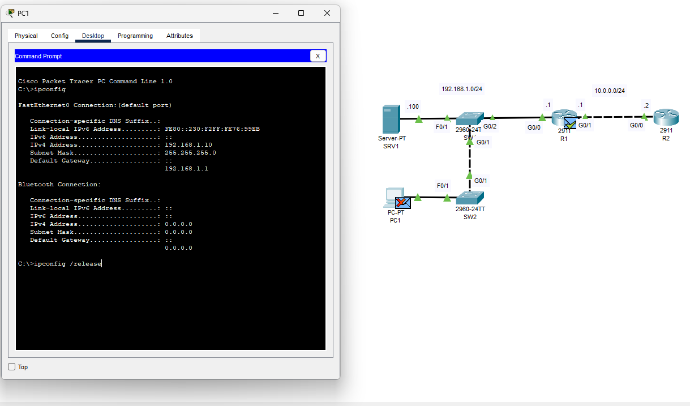
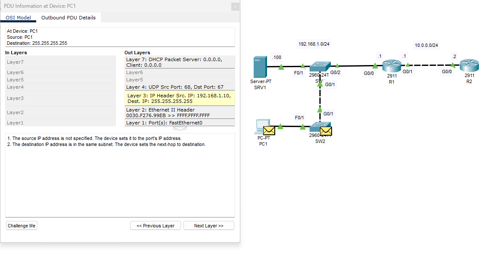

# Day 03 - OSI Model & DHCP Packet Analysis

## Overview

This lab was completed as part of my CCNA studies using Cisco Packet Tracer.

The objective of this exercise was to understand how data moves through the OSI Model by analyzing DHCP communication between a client device and a DHCP server.

Rather than simply memorizing the seven layers of the OSI Model, this lab focused on observing a real packet as it traveled through the network and identifying the role each layer plays in the communication process.

---

## Network Topology

 

---

## Lab Objective

The goal of this lab was to:

* Observe packet encapsulation
* Analyze DHCP communication
* Understand how the OSI Model applies to real network traffic
* Identify Layer 2, Layer 3, and Layer 4 information within a packet
* Observe the DHCP Discover process
* Examine source and destination addressing

---

## Devices Used

### Client Device

* PC1

### Network Infrastructure

* Switch SW1
* Switch SW2
* Router R1
* Router R2

### Server Infrastructure

* DHCP Server (SRV1)

---

## Network Addressing

### Local Network

```text
192.168.1.0/24
```

### Router Interface

```text
R1: 192.168.1.1
```

### DHCP Server

```text
SRV1: 192.168.1.100
```

### WAN Network

```text
10.0.0.0/24
```

---

## DHCP Communication Process

The lab focused on analyzing the DHCP Discover packet generated by PC1.

When the client requests network configuration information, it does not yet know the location of the DHCP server.

Because of this, the request is sent as a broadcast.

### Layer 3 Information

Source IP:

```text
192.168.1.10
```

Destination IP:

```text
255.255.255.255
```

The destination address represents a broadcast address, allowing all devices on the local network to receive the request.

---

### Layer 4 Information

Protocol:

```text
UDP
```

Source Port:

```text
68
```

Destination Port:

```text
67
```

These ports are used specifically for DHCP communication between clients and servers.

---

## OSI Layer Analysis

### Layer 1 - Physical

Responsible for transmitting bits across the physical network media.

Examples:

* Copper Ethernet
* Fiber Optic Cabling
* Electrical Signals

---

### Layer 2 - Data Link

Responsible for:

* MAC Addressing
* Frame Creation
* Local Network Communication

Observed in the packet:

```text
Destination MAC:
FFFF.FFFF.FFFF
```

This indicates a broadcast frame.

---

### Layer 3 - Network

Responsible for:

* IP Addressing
* Routing
* Logical Communication

Observed:

```text
Source IP: 192.168.1.10
Destination IP: 255.255.255.255
```

---

### Layer 4 - Transport

Responsible for:

* End-to-End Communication
* Port Numbers
* Segmentation

Observed:

```text
UDP Source Port: 68
UDP Destination Port: 67
```

---

### Layer 7 - Application

Responsible for application services.

Observed:

```text
DHCP Discover
```

This is the application-level request sent by the client to locate a DHCP server.

---

## Packet Encapsulation

During the DHCP process, information is added at each layer before transmission.

Example:

```text
Application Data
↓
UDP Header
↓
IP Header
↓
Ethernet Header
↓
Physical Transmission
```

This process is known as encapsulation.

---

## Key Concepts Learned

### Broadcast Communication

Clients use broadcast traffic when they do not know the address of the DHCP server.

### DHCP Process

The client must obtain:

* IP Address
* Subnet Mask
* Default Gateway
* DNS Information

before communicating on the network.

### OSI Model Application

The OSI Model is not simply a memorization exercise.

Each layer performs a specific role that contributes to successful communication between devices.

---

## Skills Practiced

* OSI Model Analysis
* DHCP Fundamentals
* Packet Encapsulation
* Layer 2 Communication
* Layer 3 Communication
* UDP Analysis
* Broadcast Traffic Analysis
* Cisco Packet Tracer Simulation Mode
* Network Troubleshooting Fundamentals

---

## What I Learned

This lab helped bridge the gap between theory and practical networking.

Following a DHCP packet through the OSI layers made it easier to understand how devices communicate and how information is added and processed at each layer.

Rather than memorizing definitions, I was able to observe the communication process in real time and gain a deeper understanding of packet flow within a network.

This knowledge provides a strong foundation for future networking concepts including switching, routing, VLANs, ACLs, and network troubleshooting.
